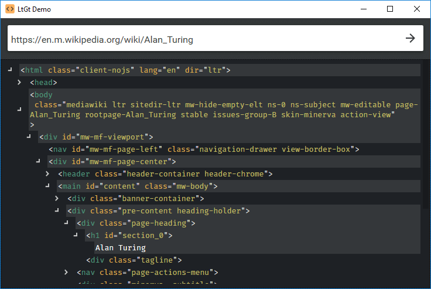
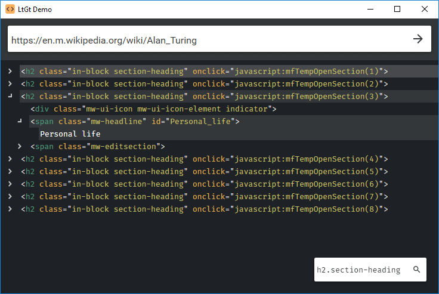

# LtGt

[](https://ci.appveyor.com/project/Tyrrrz/LtGt/branch/master)
[](https://ci.appveyor.com/project/Tyrrrz/LtGt/branch/master/tests)
[](https://codecov.io/gh/Tyrrrz/LtGt)
[](https://nuget.org/packages/LtGt)
[](https://nuget.org/packages/LtGt)
[](https://patreon.com/tyrrrz)
[](https://buymeacoffee.com/tyrrrz)

LtGt is a minimalistic library for working with HTML. It can parse any HTML5-compliant code into an object model which you can use to traverse nodes or locate specific elements. The library establishes itself as a foundation that you can build upon, and comes with a lot of extension methods that can help navigate the DOM easily. It also supports HTML rendering, so you can turn any HTML object tree to code.

_Currently, the object model in LtGt is immutable so it cannot be used to manipulate DOM directly._

## Download

- [NuGet](https://nuget.org/packages/LtGt): `dotnet add package LtGt`
- [Continuous integration](https://ci.appveyor.com/project/Tyrrrz/LtGt)

## Features

- Parse any HTML5-compliant code
- Use LINQ to traverse HTML nodes
- Find elements using JS-like functions (`GetElementById()`, `GetElementsByTagName()`, etc)
- Find elements using CSS selectors
- Convert HTML nodes to a Linq2Xml representation (`XNode`, `XElement`, etc)
- Render HTML nodes as code
- Easily extensible with custom methods
- Targets .NET Framework 4.5+ and .NET Standard 1.0+

## Screenshots




## Usage

### Parse a document

To parse an HTML document, you may create a new instance of `HtmlParser` or use a singleton `HtmlParser.Default`.

```c#
const string html = @"<!doctype html>
<html>
  <head>
    <title>Document</title>
  </head>
  <body>
    <div>Content</div>
  </body>
</html>";

var document = HtmlParser.Default.ParseDocument(html);
```

### Parse a fragment

Besides a full document, you can also parse any other type of node.

```c#
const string html = "<div id=\"some-element\"><a href=\"https://example.com\">Link</a></div>";

// Parse an element node
var element = HtmlParser.Default.ParseElement(html);

// Parse any node
var node = HtmlParser.Default.ParseNode(html);
```

### Find specific element

There are many extension methods that should help you locate elements you want to find.

```c#
var element1 = document.GetElementById("menu-bar");
var element2 = document.GetElementsByTagName("div").FirstOrDefault();
var element3 = document.GetElementsByClassName("floating-button floating-button--enabled").FirstOrDefault();

var element1Data = element1.GetAttribute("data")?.Value;
var element2Id = element2.GetId();
var element3Text = element3.GetInnerText();
```

You can leverage the full power of CSS selectors as well.

```c#
var element = document.GetElementsBySelector("div#main > span.container:empty").FirstOrDefault();
```

### Convert to Linq2Xml

You can convert LtGt's objects to `System.Xml.Linq` objects (`XNode`, `XElement`, etc). This can be useful if you need to convert HTML to XML or if you want to use XPath to select nodes.

```c#
var htmlDocument = HtmlParser.Default.ParseDocument(html);

var xmlDocument = htmlDocument.ToXDocument();

var elements = xmlDocument.XPathSelectElements("//input[@type=\"submit\"]");
```

### Render nodes

You can turn any node or hierarchy of nodes to HTML code.

```c#
var element = new HtmlElement("div",
    new HtmlAttribute("id", "main"),
    new HtmlText("Hello world"));

var html = HtmlRenderer.Default.RenderNode(element); // <div id="main">Hello world</div>
```

## Libraries used

- [Sprache](https://github.com/Sprache/Sprache)
- [GalaSoft.MVVMLight](http://www.mvvmlight.net)
- [MaterialDesignInXamlToolkit](https://github.com/ButchersBoy/MaterialDesignInXamlToolkit)
- [NUnit](https://github.com/nunit/nunit)
- [BenchmarkDotNet](https://github.com/dotnet/BenchmarkDotNet)
- [Coverlet](https://github.com/tonerdo/coverlet)
- [Tyrrrz.Extensions](https://github.com/Tyrrrz/Extensions)

## Donate

If you really like my projects and want to support me, consider donating to me on [Patreon](https://patreon.com/tyrrrz) or [BuyMeACoffee](https://buymeacoffee.com/tyrrrz). All donations are optional and are greatly appreciated. 🙏